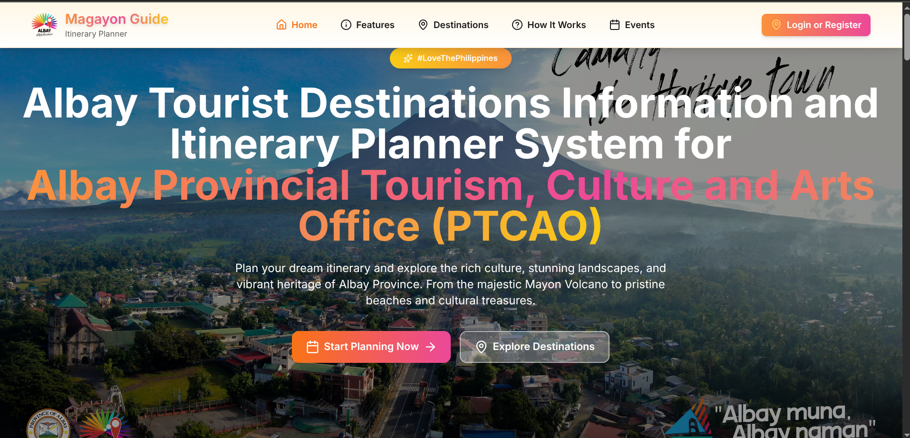
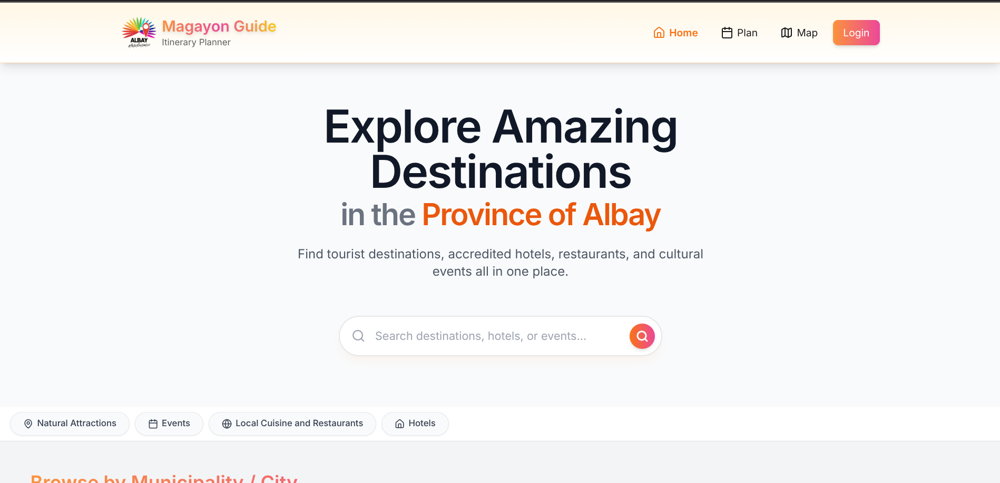
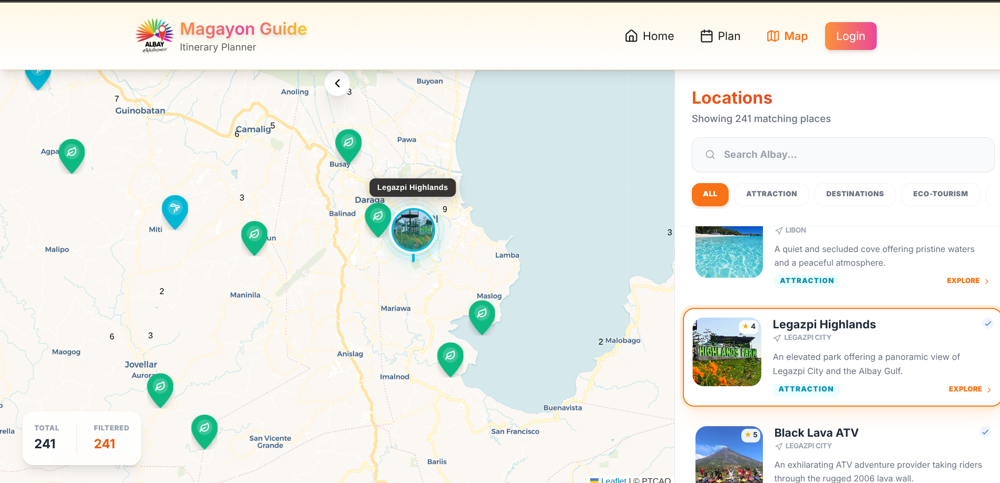
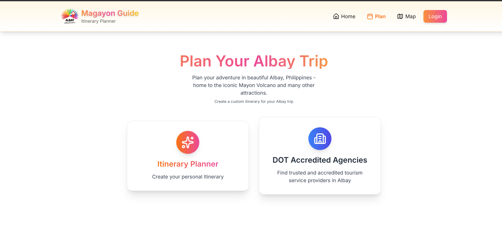
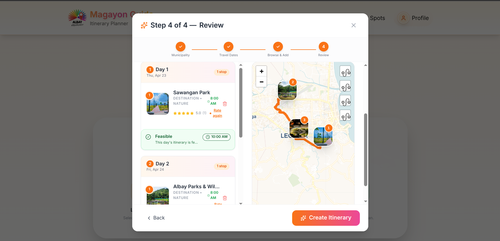
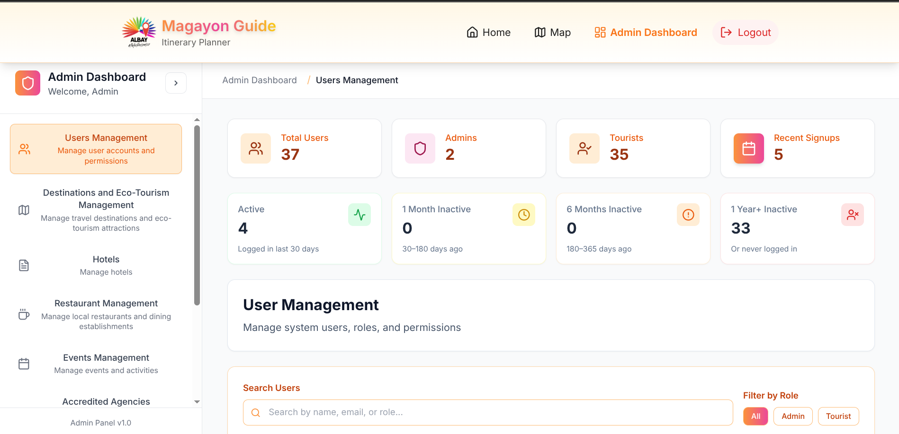

<div align="center">

# 🌋 Magayon Guide
### Albay Weekend Trip Planner & Destination Management System

[](https://magayon-guide.vercel.app/)
[](https://magayon-guide.vercel.app/)
[](https://magayon-guide.vercel.app/)
[](https://magayon-guide.vercel.app/)
[](https://magayon-guide.vercel.app/)

<br/>

> 🔒 **Note:** The source code for the frontend and backend of this system is currently kept private to protect academic and institutional integrity. This repository serves as a **technical overview, architecture showcase, and portfolio reference**.

</div>

---

## 📌 About The Project

**Magayon Guide** is a comprehensive, production-ready web application developed for the **Albay Provincial Tourism, Culture and the Arts Office (PTCAO)**. It serves as an end-to-end **weekend trip planning and destination management platform** that empowers both tourists and administrators with intelligent, data-driven tools.

The system bridges the gap between PTCAO's destination data and the modern traveler's need for personalized, real-time trip planning — with AI at its core.

---

## 💻 Tech Stack

This application is built on a modern, fully decoupled architecture with a clear separation of concerns.

### Frontend
| Technology | Purpose |
|---|---|
| **React 19** | UI framework with the latest concurrent features |
| **Vite 7** | Next-generation build tooling & HMR |
| **Tailwind CSS 3** | Utility-first styling system |
| **React Router v6** | Client-side SPA routing |
| **React Leaflet** | Interactive maps with custom markers & routing |
| **Leaflet Routing Machine** | Turn-by-turn route visualization |
| **Recharts** | Data visualization for admin analytics |
| **TanStack Query (React Query)** | Async state management & server caching |
| **React Hook Form + Yup** | Form validation with schema-based rules |
| **Cloudinary (React SDK)** | Image upload, transformation & CDN delivery |
| **@react-pdf/renderer** | Itinerary export as downloadable PDF |
| **Lucide React + React Icons** | Icon systems |
| **Vercel Analytics** | Real-time frontend usage analytics |

### Backend
| Technology | Purpose |
|---|---|
| **Node.js + Express 5** | REST API server |
| **MongoDB + Mongoose 8** | NoSQL database & ODM |
| **Google Gemini AI** (`@google/generative-ai`) | AI-powered itinerary generation |
| **JWT + Bcrypt** | Stateless authentication & password security |
| **Helmet + CORS** | Security hardening & cross-origin control |
| **Express Rate Limit** | API abuse prevention |
| **express-mongo-sanitize + XSS** | Injection & XSS attack prevention |
| **Nodemailer** | Transactional email (verification, reset) |
| **Multer** | Multipart file upload handling |
| **Geolib** | Geospatial distance calculations |
| **OpenRouteService JS** | Geographic routing & distance matrix |
| **Winston + Daily Rotate** | Structured, rotating production logs |
| **Docker** | Containerized deployment on Render |

### Infrastructure & DevOps
| Service | Role |
|---|---|
| **Vercel** | Frontend hosting with edge CDN |
| **Render** | Dockerized backend API hosting |
| **MongoDB Atlas** | Managed cloud database |
| **Cloudinary** | Media asset storage & transformation |
| **Google reCAPTCHA** | Bot protection on auth flows |

---

## ✨ Key Features

### 🤖 AI-Powered Smart Planner *(Flagship Feature)*
- Multi-step itinerary wizard: select interests → browse & add destinations → AI-generate a structured trip → review on an interactive map
- **Google Gemini AI** generates personalized day-by-day schedules with suggested visit durations, travel notes, and activity descriptions
- AI output is validated, feasibility-checked, and saved to the user's profile

### 🗺️ Interactive Map Experience
- Waze-inspired map UI using **React Leaflet** with brand-consistent orange routing
- Numbered thumbnail markers for each destination in the itinerary
- Real-time user location detection to sequence trips from the user's current position
- Synchronized map ↔ list interaction: clicking a card highlights the map marker and vice versa

### ✅ Itinerary Feasibility Engine
- Real-time trip viability checker across three tiers: **Green (feasible)**, **Yellow (tight)**, **Red (unfeasible)**
- Calculates estimated arrival times per stop using travel durations and visit windows
- Prominently displays **"LATE"** badges on activities that exceed closing times
- Prevents unfeasible itineraries from being saved

### 🧭 Manual Planner
- Drag-and-reorder trip stops with real-time distance recalculation
- Inline trip summary modal with PDF export
- Shared itinerary view via public URL for sending plans to friends

### 📊 Admin Dashboard
- Comprehensive analytics: most-visited destinations, municipality heatmaps, user registration trends
- Full CRUD for destinations, hotels, restaurants, eco-tourism activities, festivals & events
- DOT-accredited agency directory management
- Inactive user monitoring and account moderation tools

### 🔐 Auth & Security
- JWT-based authentication with refresh token flow
- Email verification on registration, password reset via Nodemailer
- Google reCAPTCHA on sensitive forms
- Rate limiting, Helmet, MongoDB sanitization, and XSS filtering on all API routes

### 🌿 Eco-Tourism Module
- Dedicated module for eco-tourism activities separate from regular destinations
- Filterable by interest category, municipality, and price range

### ⭐ Reviews & Favourites
- User review system (ratings + comments) per destination
- Favourites list saved to user profile

---

## 🏗️ System Architecture

```
┌─────────────────────────────────────────────────────────┐
│                    CLIENT (Vercel CDN)                  │
│                                                         │
│  React 19 + Vite  │  React Leaflet  │  Recharts        │
│  TanStack Query   │  RHF + Yup      │  Cloudinary SDK  │
└────────────────────────────┬────────────────────────────┘
                             │ HTTPS / REST API
┌────────────────────────────▼────────────────────────────┐
│                  API SERVER (Render / Docker)           │
│                                                         │
│  Express 5  │  JWT Auth  │  Rate Limiter  │  Helmet    │
│  Winston Logs  │  Morgan  │  Multer  │  Nodemailer     │
└──────┬─────────────────────┬───────────────────────────┘
       │                     │
┌──────▼──────┐    ┌─────────▼──────────┐
│  MongoDB    │    │  Google Gemini AI  │
│  Atlas      │    │  (AI Generation)   │
└─────────────┘    └────────────────────┘
```

---

## 📂 Data Models (Backend)

| Model | Description |
|---|---|
| `User` | Auth, profile, role (tourist/admin), email verification state |
| `Destination` | Name, category, municipality, coordinates, images, operating hours |
| `Hotel` | Accommodation listings with pricing, amenities, geo-coordinates |
| `Restaurant` | Dining options with cuisine type and location |
| `EcoTourismActivity` | Eco-activities with difficulty rating and pricing |
| `Itinerary` | Saved trip plans with ordered stops, coordinates, feasibility scores |
| `Municipality` | Albay's 18 municipalities with descriptions and geographic data |
| `Event` | Tourism festivals and seasonal events |
| `Review` | User-submitted ratings and comments per destination |
| `DotAccreditedAgency` | DOT-verified travel agencies directory |
| `Checkin` | User location check-ins at destinations |

---

## 🔌 API Surface

The backend exposes **20+ route modules**, including:

```
POST   /api/auth/register          – Register with email verification
POST   /api/auth/login             – JWT login
GET    /api/destinations           – Public destination listing (filterable)
GET    /api/destinations/:id       – Destination detail with reviews
POST   /api/ai/generate            – AI itinerary generation (Gemini)
POST   /api/itineraries            – Save a generated itinerary
GET    /api/itineraries/:id/share  – Public shared itinerary view
GET    /api/analytics/dashboard    – Admin analytics aggregations
GET    /api/trends                 – Trending destinations
POST   /api/checkins               – Log a user check-in
GET    /api/municipalities         – All 18 Albay municipalities
...and more
```

---

## 📸 System Previews

### 🏠 Landing Page


### 🏠 Homepage


### 🗺️ Interactive Map


### 📅 Trip Planning


### 🤖 AI Itinerary Planning


### 📊 Admin Dashboard


### 🎥 Feature Walkthrough
> [!TIP]
> **To add a video to your GitHub README:** 
> 1. Open this README on GitHub.com and click the "Edit" button.
> 2. Drag and drop your video file (MP4, MOV) directly into the editor.
> 3. GitHub will upload it and generate a link like `https://github.com/user-attachments/assets/...` which will render as an interactive player.


<details>
<summary>📋 View Feature Checklist</summary>

- [x] Landing page with destination showcase
- [x] Tourist browsing (by municipality, category, interest)
- [x] Smart Planner (4-step AI wizard)
- [x] Manual Planner with drag-and-reorder
- [x] Interactive map view with routing
- [x] Itinerary feasibility checker
- [x] PDF itinerary export
- [x] Shared itinerary public link
- [x] User authentication (register, login, email verification, forgot password)
- [x] User profile & saved favourites
- [x] Destination reviews & ratings
- [x] Admin CRUD for all content types
- [x] Admin analytics dashboard
- [x] Eco-tourism module
- [x] DOT-accredited agency directory
- [x] Fully responsive (mobile + desktop)

</details>

---

## 🚀 Future Roadmap & AI Integration

| Enhancement | Description |
|---|---|
| **Vertex AI / Gemini Advanced** | Predictive analytics and smarter seasonal recommendations |
| **BigQuery ML** | Machine learning on tourism trends for destination scoring |
| **Offline PWA Mode** | Allow tourists to access saved itineraries without internet |
| **Native Mobile App** | React Native companion app for on-the-ground exploration |
| **Real-time Collaboration** | Multi-user shared itinerary editing |
| **AR Destination Preview** | Augmented reality previews of tourist spots before visiting |

---

## 👨‍💻 Developer

**Eleaquim M. Mendevil**
Full-Stack Developer & UI/UX Enthusiast

Specialized in building production-grade web systems with a focus on clean architecture, user experience, and AI integration. Available for freelance and contract work.

[](https://www.upwork.com/)
[](https://github.com/KooooL-AID)

---

## 👥 Development Team & Contributions

| Developer | Role | Key Contributions & Impact |
| :--- | :--- | :--- |
| [**Eleaquim M. Mendevil**](https://github.com/KooooL-AID) | **Principal Full-Stack Developer** | Architected the Node/Express API, designed the comprehensive MongoDB schema, and spearheaded the integration of Google Gemini AI for intelligent itinerary generation. Managed full-cycle DevOps and deployment via Vercel/Render. |
| [**Ian Felix M. Lozano**](https://github.com/yamhi10) | **Frontend Developer (Initial)** | Orchestrated the initial React scaffolding, design system implementation, and foundational UI/UX layout development. |

---

<div align="center">
<sub>Developed in partnership with the Albay Provincial Tourism, Culture and the Arts Office (PTCAO) · Albay, Philippines 🇵🇭</sub>
</div>
